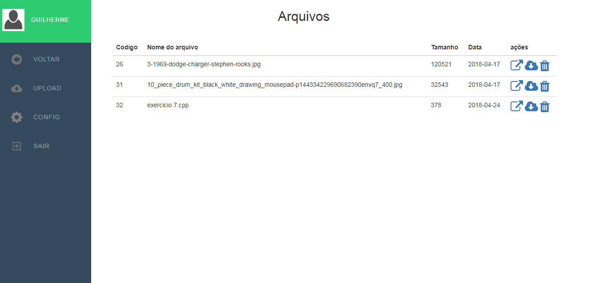

# Sistema de armazenamento
Um sistema de armazenamento de qualquer tipo de arquivo feito em php, javascript, html e css.

## Informações 
O sistema ainda esta em desenvolvimento e com um limite de 3MB de upload de arquivos, mas seu objetivo principal que é armazenar, 
fazer download, deletar arquivo e visualizar os arquivos online já estão implementados.

# Imagens do projeto

